# cumulocity-sso-provisioning

# Content
- [cumulocity-sso-provisioning](#cumulocity-sso-provisioning)
- [Content](#content)
  - [Overview](#overview)
    - [Architecture](#architecture)
    - [Known Limitation and Disclaimer](#known-limitation-and-disclaimer)
    - [Contribution](#contribution)
  - [Prerequisites](#prerequisites)
  - [Installation](#installation)
  - [Using](#using)


## Overview

The Cumulocity IoT sso provisioning microservice is a Java-based application designed to streamline the process of configuring Single Sign-On (SSO) settings for subtenants within the Cumulocity IoT platform. SSO integration is crucial for enhancing security and providing a seamless authentication experience for users.

This microservice simplifies the task of managing SSO configurations by offering a programmatic approach. It empowers administrators and developers to automate the deployment of SSO settings to multiple subtenants effortlessly.

### Architecture

The Microservice in the Cumulocity IoT architecture is responsible for facilitating the distribution of Single Sign-On (SSO) configurations from the Parent Tenant to the Child Tenants. It accomplishes this by subscribing to new tenants that are subscribed to that multi-tenant microservice.

In case of subscription, the current configuration is written locally into the subtenant.

```mermaid
graph TD
  subgraph Parent Tenant
    A((Cumulocity IoT Platform))
    B((SSO Configuration))
    A -->|Manages| B
  end

  subgraph Microservice
    M((SSO Configuration Microservice))
    B -->|Gets configuration| M
  end

  subgraph Subtenant 1
    C((Cumulocity IoT Platform))
  end

  subgraph Subtenant 2
    D((Cumulocity IoT Platform))
  end

  subgraph Subtenant N
    E((Cumulocity IoT Platform))
  end

  M -->|Copies SSO Configuration to| C
  M -->|Copies SSO Configuration to| D
  M -->|Copies SSO Configuration to| E

```



### Known Limitation and Disclaimer

Currently deletion of the configuration in case of unsubsribe is not implemented. 
It is also not implemented that a redeploy will be tried as soon as the configuration on the parent tenant changes.

### Contribution
> **Pull Requests are welcomed!**

## Prerequisites
In your Cumulocity IoT Tenant you must have the **microservice** feature subscribed. Per default this feature is not
available and must be provided by administrators of the instance you are using.

Make sure to use an user with admin privileges in your Tenant.

## Installation

You need to install the microservice component to your Cumulocity IoT Tenant.

This is provided as binaries in [Releases](https://github.com/SoftwareAG/cumulocity-sso-provisioning/releases). Take 
the binary from the latest release and upload it to your Cumulocity IoT Tenant.

You can do this in Administration App go to Ecosystem -> Microservices and click on "Add Microservice" on the top right.

<p align="center">

</p>
<br/>

Select the "zip"-file.
Make sure that you subscribe the microservice to your tenant when prompted.

## Using

As soon as the microservice is subscribed to another tenant, the configuration is added to that tenant.

<p align="center">

</p>
<br/>


You can check that in the particular section of Administration -> Settings -> Authentication -> Single Sign-on


<p align="center">

</p>
<br/>

Make sure that you have a valid and working configuration within you parent tenant. This configuration that is requested via:

```shell
GET /tenant/loginOptions/OAUTH2
```

is used for the injection into the subtenant via:

```shell
POST /tenant/loginOptions/OAUTH2
```


______________________

These tools are provided as-is and without warranty or support. They do not constitute part of the Software AG product suite. Users are free to use, fork and modify them, subject to the license agreement. While Software AG welcomes contributions, we cannot guarantee to include every contribution in the master project.

______________________

For more information you can Ask a Question in the [TECHcommunity Forums](https://tech.forums.softwareag.com/tags/c/forum/1/Cumulocity-IoT).

You can find additional information in the [Software AG TECHcommunity](https://tech.forums.softwareag.com/tag/Cumulocity-IoT).
